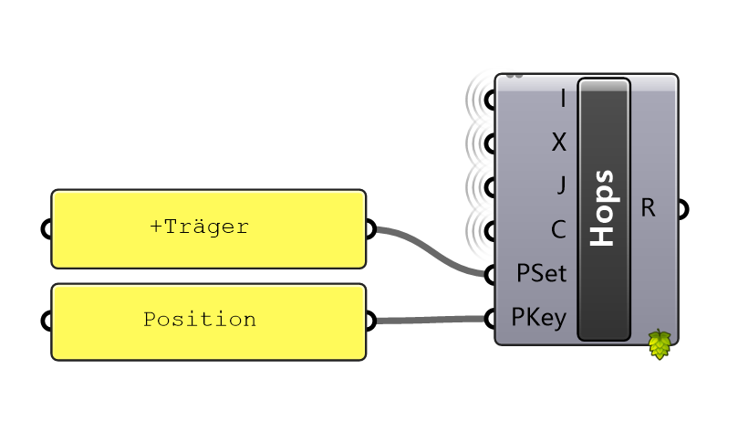

# IFC–DSTV XML Component Matcher with Grasshopper + Hops

This project implements a modular, geometry-aware component matching system between **IFC models** and **DSTV-compliant XML assembly instructions**.  
It is structured as a **Python Flask + Hops server**, fully controllable via **Grasshopper**, and capable of exporting **JSON/CSV result files** for downstream use.

---

## 🧩 Key Features

- ✅ IFC component extraction (GlobalId, position, direction, custom properties)
- ✅ XML parsing of part position and orientation
- ✅ NC file name–based matching (with fallback to geometry-based alignment)
- ✅ Rotation matrix error computation + ambiguity flag
- ✅ JSON + CSV export of match results
- ✅ Modular Hops endpoints for each processing step
- ✅ Grasshopper interface for live input & control

---

## 📁 Folder Structure

GH_IFC_Project/
├── app.py                 # Main Flask + Hops service entry point
├── core/                  # Step-wise processing logic
│   ├── step1_ifc_parser.py
│   ├── step2_xml_parser.py
│   ├── step3_match_id.py
│   └── step4_detected_updated.py
├── data/                  # Example input files (.ifc, .xml)
├── output/                # Exported result files (.json, .csv, .xlsx)
├── gh/                    # Grasshopper Hops interface files
├── LICENSE                # MIT License
├── requirements.txt       # Python dependencies
└── README.md              # You are here

## 🚀 How to Run

### 1. Install Python dependencies:

```bash
pip install -r requirements.txt

### 2. Launch the Hops server:
```bash
python app.py

Your endpoints will be available at:
```bash
http://localhost:5000/parse_ifc
http://localhost:5000/parse_xml
http://localhost:5000/match_components

### 3. Open Grasshopper + Rhino
Use the .gh files inside the gh/ folder and add Hops components with the appropriate URLs.


## 🎛️ Hops Node Interface: match_components

This Hops component performs orientation-aware matching between IFC and XML components.

| Param Name | Meaning                                                          |
| ---------- | ---------------------------------------------------------------- |
| `I`        | Path to parsed IFC JSON file (from `/parse_ifc`)                 |
| `X`        | Path to parsed XML JSON file (from `/parse_xml`)                 |
| `J`        | Output JSON path (e.g. `output/matched.json`)                    |
| `C`        | Output CSV path (e.g. `output/matched.csv`)                      |
| `PSet`     | PropertySet in IFC used to extract NC file name (e.g. `+Träger`) |
| `PKey`     | Key in the PropertySet (e.g. `Position`)                         |
These are needed to dynamically extract the NC filename from the IFC properties:
```python
i.get("Properties", {}).get(PSet, {}).get(PKey)



### OUTPUT
| Param Name | Meaning                          |                              |
| ---------- | -------------------------------- | ---------------------------- |
| `R`        | Matching summary (\`✅ Matched: X | ⚠️ Manual Check Needed: Y\`) |

## 📊 Sample Output

output/result.xlsx or output/matched.csv

| IFC\_ID | XML\_ID | Error   | Method                   | NC\_Name | NeedManualCheck |
| ------- | ------- | ------- | ------------------------ | -------- | --------------- |
| ...     | ...     | 0.00001 | unique\_nc\_name         | 1234.nc  | False           |
| ...     | ...     | 0.00321 | matrix\_direction\_match | 2538.nc  | True            |
NeedManualCheck = True indicates multiple near-identical matches by matrix.

## 📄 License
MIT License © 2025 Ye Lu

## 📬 Contact / Feedback
If you'd like to contribute, report an issue, or collaborate, feel free to contact Ye Lu or open a GitHub issue.


