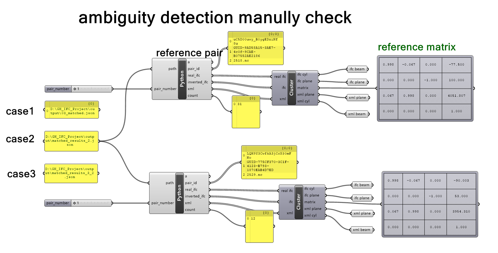
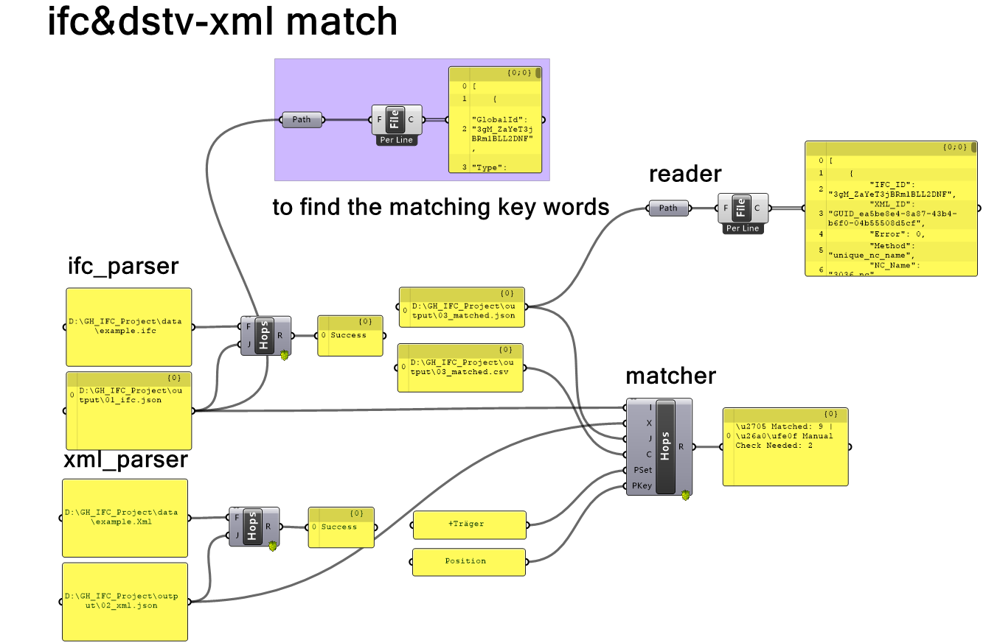

# IFC–DSTV XML Component Matcher with Grasshopper + Hops

This project implements a **modular, geometry-aware matching system** between **IFC models** and **DSTV-compliant XML assembly instructions**.  
It runs as a **Python Flask + Hops server** controlled from **Grasshopper**, and exports results to **JSON/CSV** for downstream use (validation, visualization, fabrication).

---

## 🧩 Key Features

- **IFC component extraction** (GlobalId, position, axis, ref-direction, custom properties)
- **DSTV XML parsing** (reference NC name, base, local axes)
- **Hybrid matching**  
  1) NC name/identifier match (high confidence)  
  2) Geometry-based comparison (matrix/axis alignment) as fallback
- **Error metrics** (relative rotation matrix deviation, ambiguity flag)
- **Exports**: JSON + CSV (optionally XLSX)
- **Grasshopper integration** via **Hops** (modular endpoints per step)

---

## 📁 Folder Structure

```text
GH_IFC_Project/
├── app.py                 # Flask + Hops entry point
├── core/                  # Step-wise processing logic
│   ├── step1_ifc_parser.py
│   ├── step2_xml_parser.py
│   ├── step3_match_id.py
│   └── step4_detected_updated.py
├── data/                  # Example input files (.ifc, .xml)
├── gh/                    # Grasshopper files, helpers & screenshots
│   ├── match_ifc_xml_by_nc_manulcheck.gh
│   ├── helpers/
│   │   └── manual_check.py            # (optional) GH Python helper kept out of README
│   ├── manual_check_1.png             # your screenshots (rename as you like)
│   └── manual_check_2.png
├── output/                # Exported results (.json, .csv, .xlsx) — usually gitignored
├── env/                   # Reproducible conda environments
│   └── environment.yml
├── requirements.txt       # pip packages (if you used pip)
├── LICENSE
└── README.md

```

---

## 🚀 Quick Start (local)

1. **Clone or unzip** the project to a folder like `D:/GH_IFC_Project`.

2. **Install dependencies**
   ```bash
   cd /d D/GH_IFC_Project
   # (optional) conda activate your_env
   pip install -r requirements.txt
   ```

3. **Start the Hops server**
   ```bash
   python app.py
   ```
   You should see:
   ```
   Running on http://127.0.0.1:5000
   Loaded component: ParseIFC at /parse_ifc
   Loaded component: ParseXML at /parse_xml
   Loaded component: MatchComponents at /match_components
   ```

4. **Launch Rhino + Grasshopper**
   - Start Rhino 7/8 → run `Grasshopper`
   - Open your `.gh` file (e.g. `match_ifc_xml_by_nc.gh`)

5. **Set each Hops node URL**
   ```
   http://127.0.0.1:5000/parse_ifc
   http://127.0.0.1:5000/parse_xml
   http://127.0.0.1:5000/match_components
   ```

6. **Provide file paths in Panels**
   - IFC file: `D:\GH_IFC_Project\data\example.ifc`
   - XML file: `D:\GH_IFC_Project\data\example.xml`
   - Output: `output\03_matched.json`, `output\03_matched.csv`
   - IFC PropertySet / PropertyKey used to find the NC identifier  
     e.g., **PSet** = `+Träger`, **PKey** = `Position`

> **About PropertySet and PropertyKey**  
> In **IFC**, the NC identifier is usually stored as a value inside a **PropertySet** (e.g., `+Träger`) under a **PropertyKey** (e.g., `Position`).  
> This value is mapped to your NC filename directory to obtain the true NC file name (e.g., `2538` → `2538.nc`).  
> In **DSTV XML**, the NC filename is provided directly in the `Reference` field (e.g., `2538.nc`).

---

## 🎛️ Hops Component: `match_components`


**Inputs**

| Name  | Description                                                                 |
|------:|-----------------------------------------------------------------------------|
| `I`   | Path to parsed IFC JSON (from `/parse_ifc`)                                 |
| `X`   | Path to parsed XML JSON (from `/parse_xml`)                                 |
| `J`   | Output JSON path (e.g., `output/03_matched.json`)                           |
| `C`   | Output CSV path (e.g., `output/03_matched.csv`)                             |
| `PSet`| IFC PropertySet used to extract the NC identifier (e.g., `+Träger`)         |
| `PKey`| Key inside the PropertySet (e.g., `Position`)                                |

**Output**

| Name | Description                                                                                          |
|-----:|------------------------------------------------------------------------------------------------------|
| `R`  | Matching summary string (e.g., `✅ Matched: 9 | ⚠️ Manual Check Needed: 2`)                          |

---

## 📊 Sample Output (CSV / JSON)

| IFC_ID | XML_ID | Error  | Method                   | NC_Name | NeedManualCheck |
|-------:|-------:|-------:|--------------------------|--------:|-----------------|
| …      | …      | 0.0000 | unique_nc_name           | 1234.nc | False           |
| …      | …      | 0.0032 | matrix_direction_match   | 2538.nc | **True**        |

`NeedManualCheck = True` indicates visually/algorithmically similar candidates that should be reviewed.

---

## 🔎 Ambiguity Detection & Manual Verification (Grasshopper)

When the matcher flags records with `NeedManualCheck = True`, you can review each ambiguous IFC–XML pair directly in Grasshopper.  
This workflow lets you step through the flagged pairs, inspect their local frames, and feed them into your verification cluster (planes/cylinders/matrices).




**Goal**
- Load `output/03_matched.json`
- Filter pairs where `NeedManualCheck == True`
- Use a slider **N (1…n)** to select the N-th ambiguous pair
- Output three blocks for direct Panel/Cluster use:
  - `real_ifc`: `{IFC_Location}`, `{IFC_Axis (Z)}`, `{IFC_RefDirection (X)}`
  - `inverted_ifc`: same as above, but the third row is **−RefDirection (−X)**
  - `xml`: `{XML_Base}`, `{XML_Rx (X)}`, `{XML_Ry (Y)}`
- Also output `n_pairs` (total ambiguous count) and `pair_id = [IFC_ID, XML_ID, NC_Name]`

**Wiring**
1. Run the matcher to generate `output/03_matched.json`.
2. In Grasshopper, set `path` to that file and `pair_number` to `1…n_pairs`.
3. Wire `real_ifc / inverted_ifc / xml` into your verification cluster to produce planes/cylinders/4×4 transforms.
4. Decide manually based on the visualization and metrics.

> 📄 **Repository note**  
> To keep the README concise, place the helper script in `gh/helpers/manual_check.py` (or include a small `.gh` example like `gh/manual_check_example.gh`).  
> The README only shows the workflow and screenshots.

---

## ✅ Tips & Troubleshooting

- Use **absolute Windows paths** in Panels (e.g., `D:\GH_IFC_Project\...`) to avoid working-directory issues.  
- If a Panel displays `IronPython.Runtime.List` / `System.Double[]` instead of `{x,y,z}`, convert lists to **Point3d/Vector3d** (or use your cluster inputs that accept vectors).  
- Large IFCs: start with a smaller sample to validate the pipeline before scaling up.

---

## 📄 License

MIT License © 2025 Ye Lu

---

## 📬 Contact

- Email: **luye_momo@foxmail.com**  
- GitHub: **yelu-coding** (https://github.com/yelu-coding)

